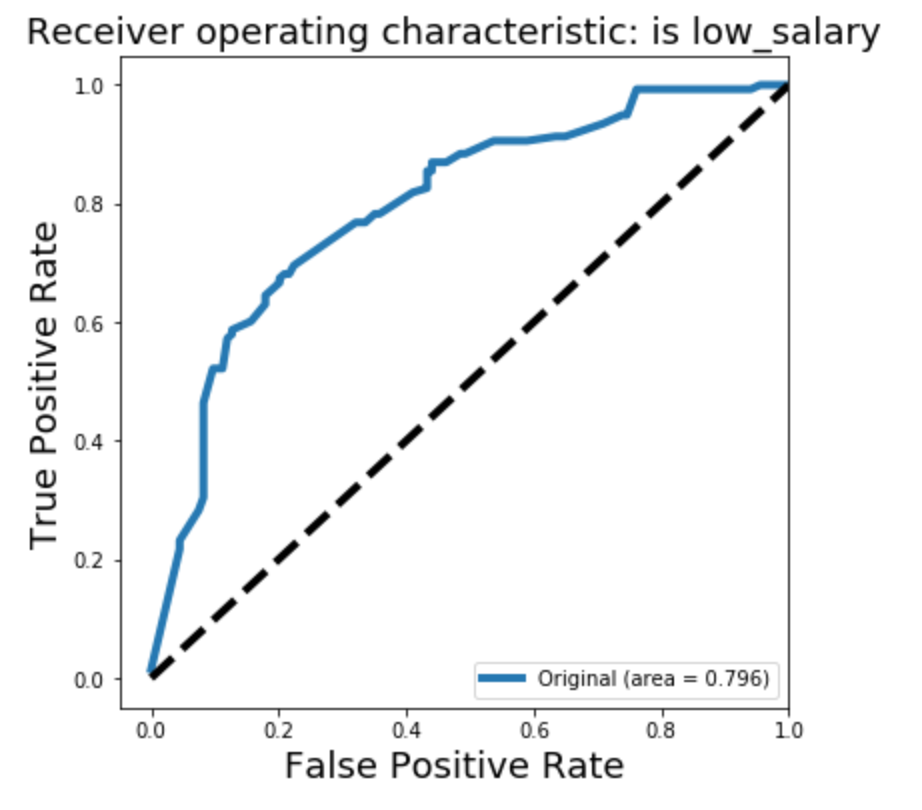

# Data Science salary prediction

In this project, we will collecting data by scraping Indeed.com and then building a binary predictor with Logistic Regression.
We are going to collect salary information on data science jobs in a variety of markets. Then using the location, title and summary of the job we will attempt to predict the salary of the job. 
Normally, we could use regression for this task; however, we will convert this problem into classification and use Logistic Regression or any other suitable classifier.

## Project walkthrough

1. [Scraping](https://github.com/Klariss/salary_prediction/blob/master/scraping%20part.ipynb)
2. [Salary prediction based on location](https://github.com/Klariss/salary_prediction/blob/master/Modeling_salaries_based_on_location.ipynb)
3. [Salary prediction based on more features](https://github.com/Klariss/salary_prediction/blob/master/Modeling_with_more_features.ipynb)
4. [Evaluation](https://github.com/Klariss/salary_prediction/blob/master/Model_evaluation.ipynb)

### [Scraping](https://github.com/Klariss/salary_prediction/blob/master/scraping%20part.ipynb)

We will be scraping job listings from Indeed.com using BeautifulSoup. Luckily, Indeed.com is a simple text page where we can 
easily find relevant entries. 

The number of city types became really high (200), because of different spellings, so I wrote a function which takes the asked 
city feature not just the city feature as it is on the webpage, so I could reduce the number of city types to 20.

### [Salary prediction based on location](https://github.com/Klariss/salary_prediction/blob/master/Modeling_salaries_based_on_location.ipynb)

Creating a classification model to predict High/Low salary. The model based only on the location. 
Using cross-validation to evaluate your models.

### [Salary prediction based on more features](https://github.com/Klariss/salary_prediction/blob/master/Modeling_with_more_features.ipynb)

Creating a classification model to predict High/Low salary. Model taking into account job levels and categories, 
besides the location.
Create a few new variables in your dataframe to represent interesting features of a job title.
For example, create a feature that represents whether 'Senior' is in the title or whether 'Manager' is in the title.
The score got better everytime I added a new feature, but with different volume, for exapmple when I built 
a model on only the "cities" and "jobtitles", the score got a lot better as opposed to predicting only on the "cities" feature.

### [Evaluation](https://github.com/Klariss/salary_prediction/blob/master/Model_evaluation.ipynb)

Adjust one of your model which rather incorrectly show a lower salary job than incorrectly show a high salary job.

Evaluating the accuracy, AUC, precision and recall of the models. 
Plotted ROC curve for the best model below. 

